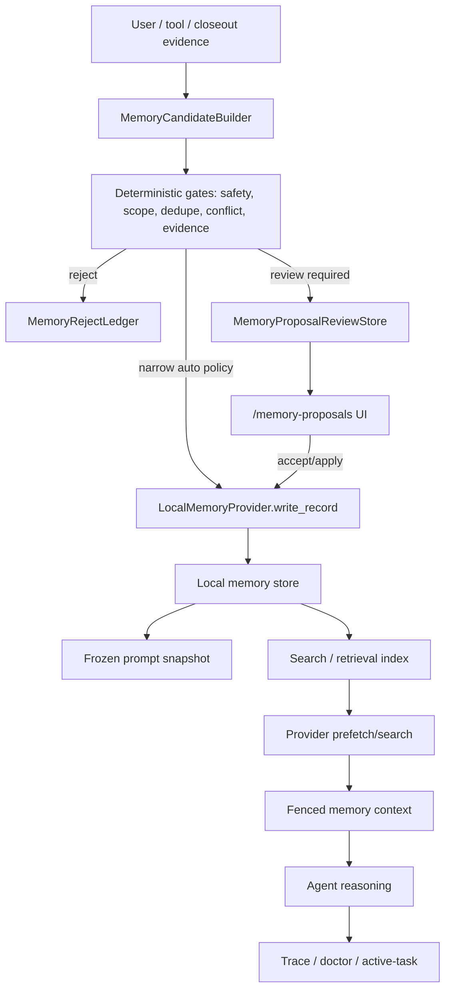

# Hermes Memory Feature Follow-up Plan
Status: Completed

Date: 2026-05-27

Owner context: Priority Agent is a local Rust coding agent. The goal of this
plan is not to copy Hermes wholesale. The goal is to learn the parts of Hermes'
memory system that make it feel like a long-running personal agent, while
preserving Priority Agent's stricter review boundary for durable memory writes.

## Executive Summary

Priority Agent already has a serious memory foundation:

- typed `MemoryScope`, `MemoryRecord`, provenance, status, and quality metadata;
- `MemoryProvider` and `MemoryProviderRegistry`;
- a base-bound `LocalMemoryProvider`;
- safety scanning and review-only default write policy;
- closeout-generated `MemoryProposal`;
- persisted `/memory-proposals list/show/accept/reject/apply`;
- active memory prototype and memory doctor surfaces.

Hermes is still stronger in memory because its memory feature is a complete
product loop, not only a storage subsystem:

- memory providers have a clear lifecycle and tool-routing surface;
- local memory storage is compact, bounded, locked, atomically written, and
  drift-aware;
- memory and user profile are exposed as a stable frozen prompt snapshot;
- a background review fork periodically revisits conversations and writes
  memory/skill updates;
- memory, skills, usage telemetry, and curator maintenance form a learning
  lifecycle;
- gateway/cron/multisession operation forced Hermes to harden session switching,
  provider scoping, shutdown, and cross-session recall.

The recommended Priority Agent direction:

1. Keep the default durable-write posture as `review_required`.
2. Move local memory storage ownership out of `MemoryManager` and into
   `LocalMemoryProvider`.
3. Make proposal review and evidence validation first-class user-visible
   memory UX.
4. Add a Hermes-style background review worker, but make it proposal-only by
   default rather than direct-write.
5. Add durable memory observability: provider lifecycle, queue state, memory
   ledger, retrieval trace, and write/reject reasons.
6. Add evals that prove the memory system improves real agent behavior without
   silently poisoning long-term context.

## Decisions Already Made

These are no longer open questions for the first implementation pass:

1. Durable LLM-derived memory is `review_required` by default.
2. Background review is proposal-only by default. It must not auto-apply memory.
3. `LocalMemoryProvider` owns local storage. `MemoryManager` orchestrates.
4. `records.jsonl` is the canonical durable memory store for typed records.
5. `MEMORY.md`, `USER.md`, and topic Markdown files are human-readable
   projections unless explicitly imported through a reviewable repair flow.
6. Manual edits to Markdown projections are treated as drift. They are surfaced
   by doctor/repair tooling, not silently trusted as canonical memory.
7. Project progress belongs in a separate project progress ledger with
   retrieval integration. It should not pollute long-term user profile memory.
8. External providers are out of the MVP and read-only first. Write mirroring
   comes only after local storage, proposal review, operation journal, and
   retrieval trace are stable.
9. Accepted memory should be editable before apply, but edit creates a new
   proposal revision and audit entry.
10. Memory evals start immediately in the first PR stack; they are not deferred
   to the final phase.
11. Durable proposals must satisfy kind-specific minimum evidence before apply.
    Accepted status alone is not enough to write long-term memory.
12. Stable user preferences do not expire automatically by default. They should
    be changed through conflict, supersession, or explicit review. Project
    progress, next steps, validation baselines, notes, and skill candidates
    carry staleness or expiration metadata.

## First PR Stack: MVP Vertical Slice

The full plan below is intentionally broad. The first execution target should be
a narrow vertical slice that proves the new lifecycle end to end.

Implementation status as of 2026-05-27:

- PR 1 is implemented in the current working tree: local provider owns canonical
  record append/replace, corrupt JSONL is detected, unsafe skips and writes are
  journaled, and memory doctor exposes recent operation journal entries.
- PR 2 is implemented in the current working tree: proposal records carry
  review metadata, `/memory-proposals show` exposes gate/status/source fields,
  and `/memory-proposals edit` creates a new review-required revision.
- PR 3 is implemented in the current working tree: closeout appends typed
  `project_status`, `next_step`, `validation_baseline`, and `open_risk`
  records to `memory/project_progress.jsonl`, separate from user profile
  memory; old active records of the same type are superseded; `/active-task`
  displays current status/next step; memory retrieval can select project
  progress records and expose them through retrieval provenance/trace.
- PR 3 depth is now covered for the MVP: project progress records are visible
  through `/project progress`, summarized in `/active-task` and `/project
  pulse`, and refreshable through explicit `/project heartbeat`.
- PR 3 visibility has been expanded with `/project progress` and a `Progress:`
  line in `/project pulse`, so the project progress ledger is inspectable
  without opening `memory/project_progress.jsonl` manually.
- PR 3 explicit project heartbeat is implemented as a pull-based maintenance
  action: `/project heartbeat` records the current project state into
  `memory/project_progress.jsonl` as a `project_status` heartbeat with evidence
  and next step. It does not schedule reminders, initiate idle chat, or write
  user-profile memory.
- Phase 3 stale project progress filtering is implemented: active project
  progress views, latest summaries, and project progress search skip records
  whose `stale_after` has passed, so old next steps and statuses remain
  auditable in the ledger without being treated as current context.
- Phase 3 project identity isolation is implemented: project progress records
  now carry `project_id` and `project_labels`; active views, latest summaries,
  search, and supersession are scoped to the current project identity so one
  repo's progress does not overwrite or get recalled as another repo's current
  state.
- Phase 4 initial frozen snapshot hardening is implemented in the current
  working tree: `LocalMemoryProvider::initialize` freezes the provider prompt
  snapshot, and later `system_prompt_block` calls return the frozen block so
  mid-session Markdown changes do not silently mutate prompt context.
- Phase 4/7 observability now includes snapshot diagnostics: `/memory snapshot`
  and `memory_load {"action":"snapshot"}` report snapshot id, fingerprint,
  active scope, stable prompt char count, memory file counts, and skipped record
  count with status/unsafe/stale/conflict reason counts; `doctor` and
  `doctor_json` include the same snapshot section. The TUI `/memory snapshot`
  panel uses the same skip reason breakdown.
- Phase 5 initial proposal-only background review is implemented in the current
  working tree: closeout builds a sanitized `BackgroundReviewPacket`, a strict
  `BackgroundMemoryReviewOutput` schema is validated, the worker emits
  `source=background` review-required proposals only, and `/memory-proposals
  list --source background` can inspect them. It does not write long-term memory.
- Phase 5 candidate-quality coverage now includes a deterministic multi-session
  eval fixture: multiple closeout reports must produce distinct background
  proposals, preserve review-required/no-write policy, include next-step,
  open-risk, and validation-baseline candidates, bind each candidate to
  source-task/closeout evidence, and classify no-validation/no-signal reports as
  rejected observations or no-op instead of inventing durable memory.
- The legacy forked/trailing LLM memory extraction paths have also been routed
  through `source=background` review-required proposals. They no longer append
  accepted long-term memory directly, and each background review uses a distinct
  task id so later reviews do not overwrite earlier proposals from the same
  session.
- Phase 6 initial retrieval tracing is implemented in the current working tree:
  memory retrieval builds a `MemoryRetrievalTrace` with selected records,
  selected chars, max record/char budget, per-scope caps, skipped unrelated
  topic records, skipped unsafe records, skipped stale conflicts, and skipped
  budget counts. `/memory search` displays the trace summary, and
  `RetrievalContextBuilt` provenance includes a compact `memory.trace` line.
- Phase 6 scoring explainability is now structured: each
  `MemoryRetrievalDecision` can carry lexical match, recency, scope match,
  confidence/trust, recall status, conflict penalty, user-pinned bonus, and
  final recall score. The memory eval suite includes fixtures proving
  user-scope selection, unrelated topic skip, stale-conflict penalty, and pinned
  memory bonus are visible in trace output.
- Phase 6 now has a combined coding-session retrieval evalset fixture: a
  project closeout query must select project convention plus user preference
  memory, stay within record/char budgets, skip unrelated topic memory, skip
  unsafe memory, downgrade stale conflicting memory, and expose score
  explanations for the selected decisions.
- Scope identity now includes an explicit `topic` identity path without changing
  existing `MemoryScope` storage: topic identities are parented to the current
  project identity when available, or to the active profile otherwise. Proposal
  review gates accept `topic:<slug>` scopes and mark bare `topic` scopes as
  `review_required` because the topic id is ambiguous.
- Project scope identity now makes monorepo behavior explicit: when the project
  root is a subdirectory under a git repository, the computed project id includes
  a normalized repo-relative `subpath` component and the identity labels include
  `git_remote`, `git_root`, and `monorepo_subpath`. Moving a repo with the same
  remote remains stable, while different monorepo packages no longer
  accidentally share one project memory namespace.
- Git-backed project scope metadata now also exposes `git_branch` and `git_dir`
  labels, including linked worktrees whose `.git` entry is a `gitdir:` file.
  Branch/worktree state is visible for review and debugging without splitting
  the project id by default.
- Proposal review now has a kind-specific `minimum_evidence` gate: explicit
  user preferences need user-statement evidence, project progress and validation
  baselines need source-task/closeout evidence plus progress/risk/validation
  evidence, and tool/failure/success memories need tool/file/trace/closeout
  evidence. This makes "No evidence means no durable memory" visible before
  apply, not only during final write.
- Applying an accepted proposal now carries its proposal evidence into the
  durable `MemoryRecord` as structured `MemoryEvidenceRef`s, including a
  proposal-id evidence entry. Proposals with missing candidate evidence are
  blocked before apply, so the review boundary and durable record stay aligned.
- Proposal review now also has a `sensitivity` gate separate from evidence:
  public/project facts pass, local/private data is review-required and must be
  minimized, while secret-like credentials and unsafe/security-sensitive
  instructions are blocked. Accepted proposals with blocked sensitivity cannot
  be applied to durable memory.
- Phase 7 initial UX polish is implemented in the current working tree:
  `/memory records [--scope project|user|session]` lists typed memory records
  with status, kind, scope, confidence, utility, evidence count, usage count, and
  updated time. `doctor` and `doctor_json` include pending memory candidate
  queue counts plus recent proposal entries, so proposal review state is visible
  without opening `memory_proposals.jsonl`.
- Phase 7 now includes last retrieval trace visibility: successful
  `/memory search` calls write a lightweight local
  `memory/retrieval_trace.json` snapshot, and `doctor`/`doctor_json` expose the
  last query, policy, selected counts, skipped counts, per-scope decisions,
  score explanations, and selected item ids for debugging retrieval behavior.
- Phase 7 also exposes the last background review without adding a second
  storage path: doctor derives it from the newest `source=background`
  proposal-review record, including status, candidate count/kinds, conflicts,
  write policy, write-performed flag, updated time, and reason.
- Phase 7 doctor now exposes local store paths for the human-facing Markdown
  projections, canonical `records.jsonl`, operation journal, proposal review
  queue, retrieval trace snapshot, decision log, and flush queue.
- Phase 7 review UX now makes `/memory-proposals show <id>` more user-facing:
  it displays review readiness, whether the memory affects future sessions,
  why it was suggested, candidate evidence excerpts, gate reports, conflict
  groups, and status history in one detail view.
- Phase 9 initial continuous eval suite is implemented in the current working
  tree: `memory::run_memory_eval_suite()` runs deterministic lifecycle fixtures
  for prompt-injection blocking, secret blocking, retrieval trace skips,
  background proposal-only review, frozen snapshot stability, and proposal
  apply-before-accept blocking. It also includes a migration backup/rollback
  fixture proving canonical records and Markdown projections can be restored.
  Each result carries `failure_owner`
  (`framework`, `llm`, `test_harness`, or `none`), and `/memory eval`,
  `memory_load {"action":"eval"}`, `doctor`, and `doctor_json` expose the suite.
- Phase 8 initial read-only external provider foundation is implemented in the
  current working tree: `MemoryProviderCapabilities` now declares provider
  hook support, `MemoryProviderRegistry` still enforces one external provider,
  external providers that request `write_mirror` or `tools` are rejected,
  unsupported hooks are reported as `SkippedUnsupported`, doctor output shows
  provider capability labels, and `NoNetworkMemoryProvider` gives tests a
  read-only external provider without network or tool-schema side effects.
- Phase 8 config path is also implemented for the conservative read-only case:
  `AppConfig.memory.external_provider` can enable a `no_network_jsonl` provider
  with a local `records_path`, name, and capability flags. `MemoryManager::new`
  loads that config opportunistically; invalid external-provider config is
  warned and ignored so local memory still starts. Real network/external
  adapters remain intentionally out of scope.
- Current full validation baseline: `cargo test -q` passes with 2063 main tests
  and 3 secondary tests after the memory lifecycle implementation.
- Phase 1/Migration repair flow now has a first reviewable implementation:
  projection drift can be converted into `source=repair` memory proposals via
  `/memory repair-proposals`, `/memory-proposals repair-drift`, or
  `memory_load {"action":"repair_proposals"}`. Applying an accepted repair
  proposal restores the missing Markdown projection entry from canonical
  `records.jsonl`, writes a backup of the user-edited Markdown bytes under
  `memory/backups/projection_repair/`, and records journal entries. It does not
  silently import Markdown edits into canonical memory.
- Migration backup/rollback has a conservative first implementation:
  `/memory migrate --dry-run`, `/memory migrate --backup`, `/memory migrate
  --rollback <backup_id>`, and `memory_load` actions `migrate_dry_run`,
  `migrate_backup`, and `migrate_rollback` report tracked memory trust files,
  create timestamped backups under `memory/backups/migration/`, and restore
  canonical records plus Markdown projections from a selected backup. Dry-run
  reports corrupt `records.jsonl` instead of loading it into prompt/retrieval.
- Phase 2 batch review operations are implemented for the proposal queue:
  `/memory-proposals list` supports source/scope/status filters,
  `/memory-proposals batch-accept` accepts proposed candidates by source/scope,
  `/memory-proposals batch-reject duplicate` rejects duplicate/conflict-looking
  proposals, `/memory-proposals cleanup-stale --days N` rejects stale proposed
  entries, and `/memory-proposals supersede <old> <new>` records a review
  rejection with supersession evidence. Each operation appends status history
  through `MemoryProposalReviewStore`.
- Phase 2 batch apply is implemented for accepted proposals:
  `/memory-proposals apply --accepted [--scope ...] [--source ...]` applies
  accepted proposals through `MemoryProposalReviewStore::batch_apply`, reports
  matched/applied candidate counts and per-proposal failures, and preserves the
  same evidence/sensitivity preflight used by single proposal apply.
- Phase 2 conflict apply preflight is implemented: single and batch apply now
  route through the same unresolved active-conflict check, so an accepted
  proposal with a still-proposed or still-accepted contradictory peer cannot
  write durable memory until the user rejects, edits, or resolves the conflict.
  `/memory-proposals conflicts` now includes per-candidate status, source,
  evidence count, value/content excerpts, and concrete inspect/resolve commands.
- Phase 2 stable review ids are implemented: `MemoryProposalReviewRecord.id`
  is now a stable `mp-*` proposal id separate from `task_id`; old records are
  backfilled at read time, new upserts preserve the existing proposal id across
  status/edit/apply transitions, and lookup accepts either the stable proposal
  id or the legacy task id.
- Phase 2 review-action operation journaling is implemented: proposal
  create/accept/reject/edit/apply/supersede/conflict-resolution transitions
  append `MemoryOperationJournal` entries with `record_id=<mp-id>` and
  `candidate_id=<task-id>`, so doctor and JSON diagnostics can audit review
  actions through the same journal used for local memory writes and unsafe
  skips.
- General typed memory lifecycle metadata is now implemented for canonical
  `MemoryRecord`s: new records carry kind-specific `stale_after` metadata,
  volatile `note`/`skill_candidate` records get default expiration metadata,
  maintenance backfills missing lifecycle fields for legacy records, expired
  accepted records are archived or skipped from retrieval, and review/retrieval
  freshness checks use the durable metadata before falling back to legacy
  heuristics.
- `MemoryManager` has been narrowed further on local search-index ownership:
  `LocalMemoryProvider` now owns the SQLite search-index path, rebuild, and
  query execution, while `MemoryManager` only assembles searchable documents and
  converts provider hits into retrieval matches.
- Projection repair local file operations have also moved behind
  `LocalMemoryProvider`: the provider resolves projection paths, checks whether
  a Markdown projection contains a canonical record id, writes the repair entry,
  backs up user-edited Markdown bytes, and journals backup/apply operations.
  `MemoryManager` still decides which canonical records need review-required
  repair proposals.
- Migration backup/rollback local file operations are now provider-owned as
  well: `LocalMemoryProvider` lists tracked memory trust files, creates backup
  manifests, restores files from backup, and preserves migration audit entries
  across rollback. `MemoryManager` still composes the user-facing migration
  report with projection-drift and repair-proposal counts.
- Scope identity has a first implementation: `MemoryScope` can now produce a
  typed identity/label for user, project, session, or agent scope. Project
  identity prefers a sanitized git remote from `.git/config` and falls back to a
  canonical path, so provider prefetch can still match project memory after a
  local repo path move when the remote identity is stable.
- Proposal conflict grouping now has a structured first implementation:
  `MemoryProposalReviewRecord` carries duplicate/conflict groups with matched
  proposal ids, candidate indexes, values, source/status, and resolution hints.
  `/memory-proposals show <id>` renders these groups, and the duplicate/conflict
  gate reports whether review is required for contradictory preferences or
  duplicate candidates.
- Proposal `edit-and-apply` is implemented: the command edits the first
  candidate, records an accepted review transition, then applies through the
  same durable memory apply path instead of bypassing review/audit history.
- Proposal conflict resolution has a guided first pass: `/memory-proposals
  conflicts` shows grouped duplicate/conflicting proposals, and
  `/memory-proposals resolve-conflict <keep-id>` accepts the kept proposal while
  rejecting unresolved duplicate/conflict peers. It does not apply durable
  memory automatically; the user still runs `/memory-proposals apply <keep-id>`
  as the explicit persistence step.

### PR 1: Local Provider Owns Canonical Records

Scope:

- move `records.jsonl` read/write helpers from `MemoryManager` into
  `LocalMemoryProvider`;
- add provider-owned atomic JSONL writes;
- add corrupt/invalid JSONL drift detection;
- add a minimal `MemoryOperationJournal`;
- keep `MemoryManager::memory_records()` as a compatibility wrapper only.

Definition of Done:

- no direct `records.jsonl` parsing remains in `MemoryManager`;
- provider tempdir tests cover read, write, duplicate, unsafe skip, and corrupt
  JSONL;
- corrupt JSONL is not injected into prompt or retrieval;
- operation journal records unsafe skip and write/apply events;
- `cargo test -q memory_provider memory_records memory_doctor` passes.

### PR 2: Proposal Review v2 Skeleton

Scope:

- extend `MemoryProposalReviewRecord` with proposal id, created/updated time,
  source session/task, active scope, and gate report skeleton;
- update `/memory-proposals show <id>` to display proposal text, target scope,
  source session/task, evidence, gate decisions, duplicate/conflict summary,
  and status history;
- make accepted proposal edit create a new revision/audit entry;
- make apply idempotent through provider APIs.

Definition of Done:

- `/memory-proposals show <id>` displays all review-critical fields;
- apply requires accepted status;
- duplicate apply does not create duplicate durable records;
- rejected proposals remain visible in audit history;
- `cargo test -q memory_proposal closeout active_task_plan` passes.

### PR 3: Minimal Project Progress Ledger

Scope:

- add a project-scoped progress ledger separate from user profile memory;
- write closeout-derived project status proposals into the ledger/proposal path;
- support `project_status`, `next_step`, `validation_baseline`, and `open_risk`
  record types;
- integrate a short project progress summary into `/active-task` and retrieval.

Definition of Done:

- project progress does not write to user profile memory;
- old project status can be superseded by newer closeout evidence;
- `/active-task` shows current project status and next step;
- `/project heartbeat` can explicitly refresh the project progress ledger
  without scheduling background contact;
- retrieval can select project progress for a coding task with trace evidence;
- `cargo test -q active_task_plan memory_proposal closeout` passes.

Do not start background review or external provider write mirroring until these
three PRs are complete.

## Hermes Sources Reviewed

Local Hermes source path:

- `/Users/georgexu/Downloads/hermes-agent-main`

Key source references:

- `agent/memory_provider.py`: provider lifecycle, one external provider policy,
  provider hooks such as `initialize`, `prefetch`, `sync_turn`, `on_session_end`,
  `on_session_switch`, `on_pre_compress`, and `on_memory_write`.
- `agent/memory_manager.py`: provider registration, prompt block aggregation,
  prefetch, queued prefetch, turn sync, tool schema routing, context fencing,
  provider shutdown.
- `tools/memory_tool.py`: bounded local `MEMORY.md` and `USER.md` stores,
  frozen prompt snapshot, strict scanning, file locking, atomic writes, drift
  detection.
- `agent/background_review.py`: forked background review agent that reviews a
  conversation snapshot, inherits the parent runtime, restricts tools to memory
  and skill management, and avoids external-provider contamination.
- `tools/skill_usage.py` and `agent/curator.py`: not memory storage directly,
  but important because Hermes treats skills as procedural memory and maintains
  their lifecycle through usage telemetry and periodic curation.

Current Priority Agent references:

- `src/memory/provider.rs`
- `src/memory/manager.rs`
- `src/memory/types.rs`
- `src/engine/task_contract.rs`
- `src/engine/conversation_loop/memory_sync_controller.rs`
- `src/tui/slash_handler/learning.rs`
- `docs/HERMES_MEMORY_SELF_EVOLUTION_REVIEW.md`
- `docs/PROJECT_STATUS.md`

## Product Goal

The memory system should make Priority Agent better at local coding work across
sessions:

- remember gex's stable preferences and project conventions;
- remember project progress, decisions, and unresolved follow-ups;
- retrieve relevant context at the right time without bloating every prompt;
- distinguish user-approved long-term memory from model guesses;
- expose what the agent remembers, why, and where it came from;
- use failures and corrections to propose future memory improvements;
- avoid turning one-off model mistakes into permanent behavioral constraints.

The important design boundary:

> The model may propose what to remember. Runtime code must decide whether the
> proposal is safe, scoped, deduplicated, evidence-backed, and reviewable. The
> default long-term write path remains review-required.

## Non-goals

This plan intentionally excludes:

- social or idle chat heartbeat;
- broad gateway/platform work;
- full Hermes skill curator parity;
- automatic prompt rewriting;
- direct model mutation of long-term behavior;
- weakening validation or review boundaries to make weak providers look better.

The plan can support future project heartbeat, but only as a project/workflow
maintenance loop, not as unsolicited social contact.

## Current Baseline

### What Priority Agent Already Has

Memory contracts:

- `MemoryScope` can represent project/user/topic-like scoping.
- `MemoryRecord` is typed and has status/provenance/quality concepts.
- Unsafe persisted records are skipped from loading.
- Memory search uses local records and search index paths.

Provider lifecycle:

- `MemoryProvider` includes hooks for initialize, prompt block, prefetch,
  search, queued prefetch, turn sync, session end, pre-compress, write
  notification, and shutdown.
- `MemoryProviderRegistry` owns local plus optional external provider.
- `LocalMemoryProvider` now owns typed record reads through `memory_records()`.

Write boundary:

- closeout/lifecycle memory sync defaults to review-only;
- legacy automatic persistence requires explicit policy opt-in;
- narrow auto-write is restricted to explicit user preference statements;
- `MemoryProposalReviewStore` persists memory proposals;
- `/memory-proposals` lets the user inspect and move proposals through
  `list/show/accept/reject/apply`.

Observability:

- memory doctor exposes provider lifecycle state;
- flush records track review-only skips;
- `/active-task` shows recent memory proposal evidence in a unified panel.

### Remaining Gaps After The Current Working Tree

The initial Hermes-inspired memory lifecycle is now implemented across provider
storage, proposal review, project progress, frozen snapshots, background
proposal generation, retrieval trace, UX surfaces, evals, migration, repair, and
typed retention metadata. The remaining gaps are narrower:

- `MemoryManager` is still larger than ideal. It now delegates canonical record
  persistence, local search-index execution, and projection repair file
  operations to `LocalMemoryProvider`. Migration file operations have also moved
  behind the provider, but repair proposal selection, migration report
  composition, search document assembly/ranking, and proposal orchestration
  still live in the manager.
- Scope identity has a first implementation for user/project/session/agent
  labels, topic identities parented to project/profile scope, moved-repo
  matching by git remote, monorepo subpath isolation, and git branch/worktree
  metadata labels. It is not yet a full namespace model for forks or explicit
  parent-child scope graphs beyond the first topic parent link.
- Proposal review has list/show/edit/apply/batch operations, unresolved active
  conflicts block durable apply, and the conflict panel shows candidate evidence
  and next commands. The UI is still CLI-oriented rather than a richer
  interactive review panel.
- Background review is proposal-only and now has a deterministic multi-session
  quality fixture. It still needs larger real transcript/replay fixtures before
  any automatic apply allowlist is considered.
- Retrieval trace now includes structured score explanations, but ranking
  thresholds and scope caps still need empirical tuning with larger real
  coding-session evalsets.
- External memory provider support is intentionally read-only and local-file
  based. Real external adapters remain later work after local lifecycle behavior
  has stayed stable.

## Design Principles

### 1. Proposal First, Persistence Second

All LLM-derived memory should flow through:

```text
observation -> candidate -> deterministic gates -> proposal -> user/policy review -> write -> retrieval evidence
```

Direct automatic writes should be limited to very narrow categories, and only
when the evidence is explicit and low-risk.

### 2. Provider Owns Storage, Manager Orchestrates

`MemoryManager` should become the coordinator:

- asks providers for prompt blocks;
- asks providers for prefetch/search;
- fanouts lifecycle hooks;
- records provider outcomes;
- enforces high-level policy.

`LocalMemoryProvider` should own local memory implementation:

- file paths;
- read/write;
- record compaction;
- atomic persistence;
- file locks;
- drift detection;
- frozen snapshots;
- local search/index integration, or a clearly owned adapter.

### 3. Canonical Store Is Explicit

Canonical durable memory records live in `records.jsonl`.

Markdown files are projections:

- `MEMORY.md`: rendered view of agent/project notes for human inspection;
- `USER.md`: rendered view of user profile/preferences;
- topic memory files: rendered topic projections.

They are not silently trusted as canonical input. If a user or external tool
edits Markdown projections manually, the local provider should detect drift and
produce a repair/import proposal:

```text
Markdown edit -> drift detected -> repair/import proposal -> review -> canonical JSONL write
```

Conflict resolution between JSONL and Markdown:

- canonical `records.jsonl` wins for prompt/retrieval;
- Markdown drift is visible in doctor;
- repair/import never happens without review;
- drift backup must preserve user-written bytes before any rewrite.

Frozen snapshots should render from canonical records plus approved projections,
not from arbitrary Markdown bytes.

### 4. Scope Is a Safety Boundary

Every memory candidate must declare scope:

- `user`: durable user preference/profile;
- `project`: project convention, current repo state, roadmap, validation habits;
- `topic`: domain or recurring task theme;
- `session`: useful only for current session/progress ledger;
- `agent`: agent operational learning, not necessarily user-facing memory.

The runtime should reject or downgrade candidates with ambiguous scope.

Scope type is not enough. Scope identity is the isolation boundary.

Target shape:

```rust
pub struct MemoryScope {
    pub kind: MemoryScopeKind,
    pub id: MemoryScopeId,
    pub parent: Option<MemoryScopeId>,
    pub labels: Vec<String>,
    pub trust_boundary: TrustBoundary,
}
```

Examples:

- project scope id: repo fingerprint, git remote, workspace root, or explicit
  project slug;
- topic scope id: normalized topic plus optional parent project/user scope;
- session scope id: session id plus parent project scope;
- agent scope id: global, provider-specific, or project-specific operational
  learning namespace.

Required behavior:

- moving a repo path should not silently fork project memory if git identity is
  stable;
- different projects for the same user should not share project memories by
  accident;
- fork/clone/monorepo behavior must be explicit in scope metadata;
- topic memory should know whether it is global or project-bound.

Implementation note: the current working tree implements computed scope
identity/labels and provider matching for moved repos with the same sanitized git
remote. It also includes repo-relative monorepo subpaths in project scope ids.
Linked worktree branch/git-dir metadata is exposed in labels without splitting
the project id by default. Persisted explicit scope metadata is still deferred
until fork and broader parent-graph semantics are settled.

### 5. Memory Is Evidence-backed

Each accepted memory record should link to evidence:

- user message excerpt or message id;
- tool observation;
- validation result;
- closeout report item;
- explicit command/user confirmation;
- proposal id.

No evidence means no durable memory.

Implementation note: proposal review now exposes a `minimum_evidence` gate so
reviewers can see whether a candidate has the minimum evidence expected for its
memory kind before accepting or applying it. Apply preflights missing evidence,
and durable `MemoryRecord`s preserve proposal id plus converted proposal
evidence refs. The deterministic memory eval suite includes explicit-user,
inferred-user, validation-baseline, and proposal-apply evidence-preservation
fixtures.

### 6. Retention And Staleness Are Typed

Different memory kinds need different lifetimes:

| Memory kind | Default retention | Staleness behavior |
| --- | --- | --- |
| `user_preference` | no default expiration | conflict requires review |
| `project_decision` | no default expiration within project | supersede only with evidence |
| `project_status` | short-lived | supersede aggressively on closeout |
| `next_step` | short-lived | stale after session/closeout transition |
| `validation_baseline` | medium-lived | stale when command/config changes |
| `open_risk` | short/medium-lived | close when validated or explicitly dismissed |
| `agent_operational_learning` | review-required | scope global/project/provider explicitly |
| `tool_quirk`, `failure_pattern`, `successful_fix` | medium-lived | stale after typed revalidation window |
| `note`, `skill_candidate` | bounded | stale early; expire if not promoted/reviewed |

Project progress, next steps, and validation baselines should carry staleness
metadata by default. Stable user preferences do not need default expiration, but
do need conflict handling.

Implementation note: canonical `MemoryRecord`s now carry `stale_after` and
optional `expires_at`. This makes freshness explainable in doctor/retrieval and
lets maintenance backfill or archive legacy records without silently trusting
Markdown projections.

### 7. Sensitivity Is Separate From Safety

Evidence-backed does not mean safe to remember. Add or harden sensitivity
classes:

| Sensitivity class | Default policy |
| --- | --- |
| `public_project_fact` | review or project policy |
| `user_preference` | review/narrow policy if explicit |
| `private_user_data` | review-required, minimized |
| `secret_or_credential` | reject/redact |
| `security_sensitive_instruction` | reject or require explicit review |
| `behavioral_policy` | review-required |

The system should record when content was rejected because it was true but too
sensitive to persist.

Implementation note: proposal review exposes a `sensitivity` gate and apply
preflights it before durable writes. Secret-like credentials and unsafe
instructions are blocked even if a proposal was manually accepted; local-only
private data remains review-required rather than auto-applied.

### 8. Conflict Resolution Is Deterministic First

Default conflict policy:

- newer explicit user correction beats older inferred preference;
- project-specific convention beats global style preference for project work;
- accepted/applied memory beats pending proposals;
- unsafe records are never selected for retrieval;
- conflicting records are skipped or downgraded unless a review action resolves
  them;
- supersession should be explicit and journaled.

### 9. Retrieval Must Be Debuggable

When memory affects a turn, we should be able to answer:

- which records were considered;
- which records were selected;
- why they ranked high;
- which scope they came from;
- whether any unsafe/stale/conflicting records were skipped;
- how many tokens/chars were injected;
- whether memory changed the agent's plan or only provided background context.

Concrete retrieval fixture expectation:

```text
Given:
  - one project-scoped convention for repo A
  - one unrelated topic memory
  - one global user style preference
  - one unsafe record
When:
  - the user asks for a coding change in repo A
Then:
  - retrieval injects <= N records and <= M chars
  - project convention is selected
  - global user style preference is selected only if budget allows
  - unrelated topic memory is skipped
  - unsafe record is skipped
  - trace includes selected count, skipped unrelated count, skipped unsafe count
```

### 10. Background Review Is Allowed, Background Mutation Is Not Default

Hermes directly lets the background review fork write memory/skills. Priority
Agent should learn the architecture but keep a stricter default:

- background worker can propose memory;
- background worker can produce review rationale;
- background worker cannot silently persist long-term memory unless a narrow
  explicit policy allows it;
- all background actions must be visible in memory doctor and proposal queue.

## Target Architecture



### Components

#### LocalMemoryProvider

Target responsibility:

- profile/project-aware path resolution;
- local memory record IO;
- memory snapshot rendering;
- safety scan on load and write;
- file locking and atomic writes;
- drift detection;
- record compaction;
- local search and ranking hooks;
- provider health/status.

#### MemoryManager

Target responsibility:

- provider registry;
- active scope;
- hook fanout;
- high-level policy;
- conversion between runtime observations and memory candidate proposals;
- integration with trace/evidence ledger;
- narrow compatibility wrapper for old call sites.

#### MemoryProposalReviewStore

Target responsibility:

- append-only proposal journal;
- latest-state projection;
- proposal detail with evidence and gate decisions;
- status transitions;
- apply through provider APIs;
- batch operations;
- audit history.

#### BackgroundMemoryReviewWorker

Target responsibility:

- run after session closeout or project heartbeat;
- inspect transcript/trace/evidence;
- generate proposals only;
- never call arbitrary tools;
- never write long-term memory by default;
- include enough reasoning summary for user review without exposing raw hidden
  chain-of-thought.

The worker should not receive raw, unlimited transcript context. It should
receive a sanitized packet:

```rust
pub struct BackgroundReviewPacket {
    pub transcript_excerpt_ids: Vec<String>,
    pub closeout_summary: String,
    pub tool_result_summaries: Vec<String>,
    pub existing_memory_digest: String,
    pub recent_rejected_proposals: Vec<String>,
    pub active_scope: MemoryScope,
    pub max_candidate_count: usize,
}
```

The worker output should be strict schema, not free-form prose:

```rust
pub struct BackgroundMemoryReviewOutput {
    pub candidates: Vec<MemoryCandidate>,
    pub no_op_reason: Option<String>,
    pub rejected_observations: Vec<RejectedObservation>,
}
```

The deterministic gates consume this schema. The worker can explain why it
found no candidates, but it cannot bypass gates or write storage directly.

#### MemoryDoctor

Target responsibility:

- provider lifecycle status;
- active scope;
- snapshot status;
- queue status;
- retrieval trace;
- skipped unsafe/stale/conflicting records;
- last background review status;
- storage health/drift status.

## Data Model Additions

### MemoryCandidateGateReport

Add a structured gate report for every candidate:

```rust
pub struct MemoryCandidateGateReport {
    pub candidate_id: String,
    pub safety: GateDecision,
    pub scope: GateDecision,
    pub evidence: GateDecision,
    pub dedupe: GateDecision,
    pub conflict: GateDecision,
    pub sensitivity: GateDecision,
    pub final_decision: MemoryGateDecision,
    pub reasons: Vec<String>,
}
```

This should be stored with proposals so review can explain why something is
blocked, proposed, or eligible for narrow auto-write.

### MemoryProposalReviewRecord v2

Extend proposal records with:

- proposal id separate from task id;
- created_at;
- updated_at;
- source session id;
- source task id;
- active scope at creation;
- candidate gate reports;
- reviewer action history;
- applied record ids;
- superseded proposal ids.

### MemoryOperationJournal

Append-only record for all memory operations:

- candidate proposed;
- candidate rejected;
- proposal accepted;
- proposal rejected;
- proposal applied;
- record superseded;
- record compacted;
- unsafe record skipped on load;
- drift detected;
- external provider hook failed.

This is distinct from long-term memory content. It is operational evidence.

### FrozenSnapshot

Represent the prompt snapshot explicitly:

```rust
pub struct MemorySnapshot {
    pub snapshot_id: String,
    pub scope: MemoryScope,
    pub created_at: String,
    pub records: Vec<String>,
    pub char_count: usize,
    pub skipped: Vec<MemorySnapshotSkip>,
    pub fingerprint: String,
}
```

This makes prompt-cache stability auditable.

## Detailed Implementation Plan

### Phase 0: Baseline Audit And Test Fixtures

Goal: lock down current behavior before moving ownership.

Tasks:

1. Add a memory architecture fixture document under `tests/fixtures/memory/`.
2. Add sample records:
   - safe project convention;
   - explicit user preference;
   - unsafe prompt injection;
   - duplicate record;
   - conflicting record;
   - stale record;
   - manually drifted memory file;
   - review-only proposal.
3. Add a small test helper that builds a temp `MemoryManager` with a
   base-bound `LocalMemoryProvider`.
4. Add snapshot tests for:
   - `memory_records()`;
   - snapshot prompt block;
   - proposal list/show/apply;
   - unsafe load skip;
   - duplicate write behavior.
5. Document current behavior as "baseline before provider extraction".

Acceptance criteria:

- `cargo test -q memory` passes.
- Existing `/memory-proposals` tests still pass.
- The baseline tests fail if old direct JSONL read paths are reintroduced into
  new high-level call sites.
- Minimal eval fixtures exist from the beginning:
  - unsafe persisted record blocked;
  - duplicate apply idempotent;
  - next-session snapshot sees applied memory;
  - retrieval trace names selected and skipped records.

Risk:

- Tests may expose existing coupling. That is desirable; fix only after the
  baseline captures the current contract.

### Phase 1: Move Local Storage Fully Into LocalMemoryProvider

Goal: make `LocalMemoryProvider` the only owner of local memory storage details.

Tasks:

1. Move path ownership:
   - `MEMORY.md`;
   - `USER.md`;
   - topic memory files;
   - `records.jsonl`;
   - search index path if local provider owns it;
   - operation journal path.
2. Move typed record read/write:
   - `read_local_memory_records`;
   - `write_memory_records`;
   - record maintenance;
   - status filtering;
   - local safety scan on load.
3. Add provider write APIs:
   - `write_record(record, scope)`;
   - `update_record_status(id, status)`;
   - `supersede_record(old_id, new_record)`;
   - `compact_records(policy)`.
4. Add atomic write and file locking:
   - write temp file in same directory;
   - fsync before replace where practical;
   - separate lock file for read-modify-write cycles;
   - no partially written JSONL on crash.
5. Add drift detection:
   - records JSONL parse errors;
   - unexpected free-form edits in Markdown memory files;
   - duplicate ids;
   - unsupported schema versions.
6. Keep `MemoryManager` methods as wrappers during migration, but mark them as
   orchestration methods, not storage owners.

Files likely touched:

- `src/memory/provider.rs`
- `src/memory/manager.rs`
- `src/memory/types.rs`
- `src/tools/memory_tool/mod.rs`

Acceptance criteria:

- A grep for local storage implementation in `MemoryManager` should show only
  orchestration and compatibility wrappers, not direct file parsing/writing.
- `LocalMemoryProvider` can be tested independently with a temp base directory.
- Unsafe persisted content is never injected into prompt/retrieval.
- Concurrent write tests do not lose records.
- `records.jsonl` is treated as canonical; Markdown projection drift is detected
  and reported instead of silently imported.
- Doctor reports local provider health and drift status.
- Projection drift can be converted into review-required repair proposals, and
  applying accepted repairs backs up raw Markdown before restoring canonical
  projection entries.

Suggested tests:

```bash
cargo test -q memory_provider
cargo test -q memory_records
cargo test -q memory_doctor
cargo test -q memory_proposal
cargo test -q closeout
```

### Phase 2: Memory Proposal Review Queue v2

Goal: make memory review a real product surface, not just a command wrapper.

Tasks:

1. Add stable proposal ids independent of task ids. Implemented with `mp-*`
   review ids while preserving legacy task-id lookup.
2. Store full gate report per candidate. Implemented with optional
   `candidate_index` on gate decisions plus per-candidate minimum-evidence,
   sensitivity, and scope-identity gates.
3. Add proposal source:
   - closeout;
   - manual tool;
   - background review;
   - project heartbeat;
   - import;
   - repair.
4. Add queue filters:
   - pending;
   - accepted;
   - rejected;
   - applied;
   - blocked;
     Implemented as `--blocked`, matching proposals with blocked or missing
     gate decisions.
   - by scope;
     Implemented as `--scope`.
   - by project;
     Implemented as `--project <id|label>` backed by `project_id` and
     `project_labels` on review records.
   - by source.
     Implemented as `--source`.
5. Add detail view. `/memory-proposals show <id>` must display:
   - proposal text;
   - target scope;
   - source session/task;
   - evidence excerpt or evidence id;
   - gate decisions;
   - duplicate/conflict matches, if any;
   - status transition history.
   - Structured duplicate/conflict groups are implemented with proposal ids,
     candidate indexes, values, status/source, and resolution hints.
6. Add operations:
   - accept;
   - reject;
   - edit;
   - apply;
   - edit-and-apply. Implemented.
   - apply accepted by source/scope. Implemented.
   - batch accept by source/scope. Implemented.
   - batch reject stale/duplicate. Implemented.
   - supersede. Implemented as a review rejection with supersession reason.
   - conflict resolution. Implemented with grouped display plus keep/reject
     resolution that preserves explicit apply as a separate step.
   - unresolved active-conflict apply preflight. Implemented.
7. Add audit log entries for every review action. Implemented through
   `MemoryOperationJournal` entries for review transitions.

TUI command shape:

```text
/memory-proposals list [--pending] [--scope user|project|topic] [--source closeout|background]
/memory-proposals show <id>
/memory-proposals accept <id>
/memory-proposals reject <id> [--reason "..."]
/memory-proposals edit <id>
/memory-proposals apply <id>
/memory-proposals apply --accepted --scope project
```

Acceptance criteria:

- `/memory-proposals show <id>` prints all review-critical fields listed above.
- User can understand why every proposal exists from evidence and gate reports.
- User can apply only accepted proposals.
- Applying writes through `LocalMemoryProvider`, not direct manager storage.
- Duplicate apply is idempotent.
- Rejected proposals are preserved for audit.

### Phase 3: Minimal Project Progress Memory

Goal: support the thing gex cares about early: the software should know what
projects have been worked on and current progress, without polluting long-term
user profile memory.

Design:

- keep a project progress ledger separate from user profile memory;
- summarize current goal, completed changes, validation status, open risks;
- update from closeout and explicit project heartbeat;
- treat project progress as scoped project memory, not global user memory.

Candidate record types:

- `project_decision`;
- `project_status`;
- `validation_baseline`;
- `open_risk`;
- `next_step`;
- `user_preference`;
- `agent_operational_learning`.

Policy:

- project progress can be proposed automatically;
- durable project status still needs evidence;
- risky behavioral changes remain review-required;
- stale project status should be superseded rather than duplicated.

Acceptance criteria:

- `/active-task` and memory search can show current project progress.
- Old project status is superseded when a new status lands.
- User profile memory does not fill with per-project implementation details.
- `project_status`, `next_step`, and `validation_baseline` carry staleness
  metadata by default.
- Active project progress views and search skip stale records. Implemented.
- Active project progress views, search, and supersession are scoped by project
  identity. Implemented.

### Phase 4: Frozen Memory Snapshot And Prompt-cache Discipline

Goal: copy Hermes' strongest local-memory invariant: session prompt memory is a
frozen snapshot, while live memory writes are durable but do not mutate the
current stable prompt prefix.

Tasks:

1. Add `MemorySnapshot` generated at session/bootstrap time.
2. Separate:
   - snapshot used in system prompt;
   - live provider state used by tools/review UI;
   - retrieval/prefetch context injected as dynamic context.
3. Add snapshot fingerprint to prompt-context reports.
4. Add snapshot skip report for unsafe/stale/conflicting entries. Implemented:
   `/memory snapshot`, `memory_load {"action":"snapshot"}`, `doctor`, and
   `doctor_json` expose skipped record totals with status, unsafe, stale, and
   conflict reason counts.
5. Ensure mid-session memory apply does not silently alter the stable system
   prompt; it should affect future retrieval only if explicitly designed and
   traced.
6. Add a `/memory snapshot` or `memory_load {"action":"snapshot"}` diagnostic.
   Implemented.

Acceptance criteria:

- A memory write during a session does not change stable system prompt
  fingerprint.
- A new session sees the updated frozen memory snapshot.
- Memory doctor reports snapshot id, scope, char count, skipped records,
  skip reasons, and fingerprint.

Risks:

- Some current tests may expect immediate prompt visibility. Those tests should
  be changed to retrieval visibility or next-session visibility, depending on
  the intended contract.

### Phase 5: Proposal-only Background Memory Review

Goal: learn Hermes' background review pattern while preserving Priority Agent's
review-required safety boundary.

Hermes behavior to learn:

- fork a review agent;
- inherit parent runtime;
- restrict tools;
- suppress noisy status;
- avoid external provider contamination;
- summarize actions to the user.

Priority Agent adaptation:

- background worker generates `MemoryProposal`s;
- no direct long-term write by default;
- can be disabled;
- runs at safe lifecycle points only;
- records trace and doctor status.

Trigger policy:

- after session closeout;
- after explicit `/memory review`;
- after project heartbeat, once implemented;
- optionally every N user turns for persistent interactive sessions;
- never inside eval/headless/test unless explicitly enabled.

Worker contract:

```text
input:
  sanitized BackgroundReviewPacket
  execution report
  closeout evidence
  active scope
  recent proposals
  memory snapshot summary

allowed actions:
  propose memory
  classify no-op
  explain rejected candidates

forbidden actions:
  write MEMORY.md directly
  call shell/file tools
  call external memory providers
  mutate prompt/instructions
```

Acceptance criteria:

- Background review cannot write long-term memory unless an explicit test-only
  or narrow policy path is enabled.
- Background review proposals appear in `/memory-proposals list --source background`.
- If the model produces unsafe/ambiguous memory, runtime gates reject or mark
  blocked.
- Worker failures are visible but never fail the main user turn.
- Worker output is parsed from strict schema; free-form output is rejected or
  converted to a no-op with a visible parse failure.

Suggested tests:

```bash
cargo test -q background_memory_review
cargo test -q memory_proposal
cargo test -q memory_sync
cargo test -q closeout
```

### Phase 6: Scope-aware Retrieval And Prefetch Trace

Goal: improve usefulness, not just storage.

Tasks:

1. Make retrieval explicitly scope-aware:
   - current project first;
   - user preferences always considered but tightly budgeted;
   - topic memories only when topic matches;
   - agent operational memories fenced as internal guidance.
2. Add retrieval score explanation:
   - lexical match. Implemented.
   - recency. Implemented.
   - scope match. Implemented.
   - confidence. Implemented as trust/confidence factor.
   - status. Implemented as recall decision status.
   - conflict penalty. Implemented.
   - user-pinned bonus. Implemented for pinned memory record sources/tags.
3. Add `MemoryRetrievalTrace` to trace/evidence ledger.
4. Add dynamic context budget:
   - max records;
   - max chars/tokens;
   - per-scope caps;
   - stale/conflict skip count.
5. Add retrieval regression fixtures:
   - user preference wins on style questions. Implemented in the coding-session evalset.
   - project convention wins on repo work. Implemented in the coding-session evalset.
   - unrelated topic memory is not injected. Implemented.
   - unsafe memory is skipped. Implemented.
   - stale conflicting memory is downgraded. Implemented.

Acceptance criteria:

- For any answer influenced by memory, trace can show selected records and
  reasons.
- Retrieval does not inject large irrelevant memory blocks.
- A bad memory record can be diagnosed from doctor/trace output.
- Given a project-scoped coding task and unrelated topic/user records, retrieval
  injects <= N records, <= M chars, 0 unrelated topic records, and trace includes
  skipped unrelated/unsafe counts.

### Phase 7: Memory Doctor And UX Polish

Goal: make memory understandable to users and debuggable by developers.

Commands/panels:

```text
/memory doctor
/memory snapshot
/memory records [--scope project]
/memory search <query>
/memory-proposals ...
/active-task
```

Doctor should show:

- provider lifecycle table;
- local store paths; implemented for projections, canonical records, operation
  journal, proposals, retrieval trace, decisions, and flush queue;
- active scope;
- snapshot fingerprint;
- proposal queue counts;
- recent applied/rejected proposals;
- last background review; implemented from the latest `source=background`
  proposal-review record;
- last retrieval trace; implemented via the local `memory/retrieval_trace.json`
  snapshot written by `/memory search`;
- unsafe skips;
- drift status;
- external provider status if present.

User-facing copy should avoid internal jargon where possible:

- "Pending memory candidates" instead of "review queue internals";
- "Why this was suggested" instead of "gate report";
- "Will affect future sessions" for durable snapshot behavior.

Acceptance criteria:

- A user can answer "what does the agent remember about this project?" without
  opening files manually.
- A developer can answer "why did this memory affect the answer?" from trace.
- A failed provider hook is visible but not catastrophic.

### Phase 8: External Provider Path

Goal: reach Hermes-like provider extensibility without bloating the main tool
surface.

Decision: external providers are out of MVP and read-only first. They should not
mirror writes until local provider storage, proposal review, operation journal,
and retrieval trace are stable.

Tasks:

1. Define external provider configuration format. Implemented for the
   conservative `no_network_jsonl` read-only adapter.
2. Enforce one external provider at a time. Implemented for the registry.
3. Add provider setup/doctor output. Config loading and doctor output are
   implemented; interactive setup remains later.
4. Add provider capability flags. Initial implementation covers:
   - prompt block;
   - prefetch;
   - search;
   - queue prefetch;
   - sync turn;
   - session end;
   - pre-compress;
   - write mirror;
   - tools.
5. Add a no-network fake provider for tests. Implemented as
   `NoNetworkMemoryProvider`.
6. Add optional adapters later, after local provider is solid.
7. Keep external providers read-only: reject write mirroring and tool schema
   exposure until a later explicit milestone.

Acceptance criteria:

- Adding an external provider cannot create duplicate/conflicting tool schemas.
- Provider failures are isolated and visible.
- Local memory remains available when external provider fails.
- A read-only external provider cannot receive write/session/pre-compress hooks
  unless its capabilities explicitly allow those hooks.

### Phase 9: Continuous Eval Suite

Goal: prove the memory system helps, and separate framework failures from LLM
reasoning failures. The minimal fixtures start in Phase 0 and the suite grows
with every milestone; this is a continuous gate, not a final cleanup phase.

Eval categories:

1. Memory safety:
   - prompt injection record is blocked;
   - sensitive data is rejected or redacted;
   - unsafe proposal cannot apply.
2. Scope correctness:
   - user preference goes to user scope;
   - project convention goes to project scope;
   - one-off task detail stays session/progress only.
3. Review workflow:
   - proposal generated;
   - list/show displays evidence;
   - accept/apply writes record;
   - reject preserves audit;
   - duplicate apply is idempotent.
4. Retrieval:
   - relevant project memory selected;
   - unrelated topic memory skipped;
   - stale memory downgraded;
   - selected memory appears in trace.
5. Background review:
   - worker produces proposals;
   - worker cannot write directly;
   - worker failure does not fail main turn.
6. Multi-session:
   - new session sees frozen snapshot;
   - mid-session write does not mutate stable prompt prefix;
   - next session sees applied memory.
7. Failure ownership:
   - framework bug when gate misses unsafe write;
   - LLM error when proposed content is bad but gate catches it;
   - model failure when it ignores retrieved memory despite correct injection.
8. Migration and repair:
   - dry-run reports canonical memory trust files;
   - backup exposes a rollback id;
   - rollback restores canonical records plus Markdown projections;
   - projection drift becomes review-required repair proposals, not silent
     imports.

Suggested commands:

```bash
cargo fmt --check
cargo check -q
cargo test -q memory_provider
cargo test -q memory_records
cargo test -q memory_proposal
cargo test -q memory_doctor
cargo test -q closeout
cargo test -q active_task_plan
cargo test -q
cargo check --features experimental-api-server -q
```

Live eval additions:

- `memory-review-queue`;
- `memory-background-proposal-only`;
- `memory-project-progress-ledger`;
- `memory-retrieval-scope-ranking`;
- `memory-unsafe-record-block`;
- `memory-next-session-snapshot`.

## Migration And Repair Spec

Storage migration must be conservative because memory is user trust state.

Commands or equivalent tool actions:

```text
memory migrate --dry-run
memory migrate --backup
memory migrate --rollback <backup_id>
memory doctor --repair-proposals
memory_load {"action":"repair_proposals"}
memory_load {"action":"migrate_dry_run"}
memory_load {"action":"migrate_backup"}
memory_load {"action":"migrate_rollback","backup_id":"<backup_id>"}
```

Migration rules:

- create a backup before any mutating migration;
- preserve raw bytes of existing Markdown and JSONL files;
- detect unsupported schema versions;
- do not silently import Markdown projection drift;
- generate repair/import proposals for user review;
- projection repair apply preserves a backup of the drifted Markdown bytes
  before restoring canonical projection content;
- support rollback to the pre-migration backup;
- write a migration operation journal entry.

Definition of Done:

- dry-run reports what would change without writing;
- backup id is visible in doctor/migration output;
- rollback restores canonical records and projections;
- corrupt input never enters prompt/retrieval during migration.

## Failure Ownership Policy

This is important for gex's testing philosophy.

Framework failure:

- unsafe memory is persisted;
- proposal bypasses review without allowed policy;
- wrong scope is accepted by deterministic validation;
- duplicate/conflict detection misses obvious duplicate;
- background worker mutates long-term memory by default;
- memory affects prompt without trace;
- provider failure breaks main task.

LLM failure but framework handled correctly:

- model proposes bad/irrelevant memory and runtime rejects it;
- model ignores relevant retrieved memory despite trace proving it was provided;
- model produces an over-broad summary and proposal queue marks it as ambiguous;
- model suggests a one-off project detail as user profile and scope gate blocks it.

Repair strategy:

- framework failures require code changes and regression tests;
- LLM failures should feed back as structured observations, proposal rejection
  reasons, or eval examples;
- do not add broad always-on prompt rules for one-off LLM mistakes;
- prefer gates, schemas, scoped context, and review UI.

## Proposed Milestones

### Milestone A: Storage Ownership

Deliverables:

- `LocalMemoryProvider` owns local read/write/maintenance.
- `MemoryManager` is mostly orchestration.
- atomic writes and drift detection exist for local memory.
- baseline tests pass.

Expected impact:

- cleaner architecture;
- easier provider testing;
- lower risk of hidden file corruption.

Definition of Done:

- no direct `records.jsonl` parsing remains in `MemoryManager`;
- `LocalMemoryProvider` tempdir tests cover read/write/corrupt/unsafe/duplicate;
- canonical JSONL wins over Markdown projection;
- Markdown drift creates doctor/repair evidence, not silent imports;
- memory doctor reports local provider health.

### Milestone B: Review UX

Deliverables:

- memory proposal v2 record;
- richer `/memory-proposals`;
- gate report visible;
- batch review;
- operation journal.

Expected impact:

- user can truly review memory;
- mistakes become auditable;
- no hidden long-term writes.

Definition of Done:

- `/memory-proposals show <id>` displays proposal text, target scope, source
  session/task, evidence, gate decisions, duplicate/conflict matches, and status
  transition history;
- accepted proposal edits create a new revision/audit entry;
- unresolved accepted/proposed conflicts block durable apply until resolved;
- apply is idempotent;
- rejected proposals remain visible.

### Milestone C: Project Progress Memory

Deliverables:

- separate project progress ledger;
- project-scoped status records;
- `project_status`, `next_step`, `validation_baseline`, and `open_risk`;
- supersession;
- `/active-task` integration.

Expected impact:

- user can ask what happened before and where the project stands;
- project progress improves real coding continuity;
- user profile memory stays clean.

Definition of Done:

- closeout can produce project progress proposals;
- project progress does not write to user profile memory;
- stale project status can be superseded;
- `/active-task` shows current project status and next step;
- retrieval trace can show project progress selected for a coding task.

### Milestone D: Retrieval Quality

Deliverables:

- scope-aware retrieval trace;
- per-scope budget;
- stale/conflict handling;
- multi-session evals.

Expected impact:

- memory becomes useful in real coding tasks, not just stored.

Definition of Done:

- retrieval injects <= configured record/char budgets;
- unrelated topic records are skipped in the fixture case;
- unsafe records are skipped and counted;
- trace explains selected/skipped records and scope scores.

### Milestone E: Background Proposal Worker

Deliverables:

- safe background worker;
- sanitized `BackgroundReviewPacket`;
- strict `BackgroundMemoryReviewOutput`;
- proposal-only default;
- trace/doctor visibility;
- eval coverage.

Expected impact:

- closer to Hermes learning loop;
- still safer than Hermes direct background writes.

Definition of Done:

- worker cannot write long-term memory by default;
- worker cannot call shell/file/external provider tools;
- malformed output becomes visible no-op/parse failure;
- background proposals appear in review queue by source.

### Milestone F: Frozen Snapshot Hardening

Deliverables:

- explicit `MemorySnapshot`;
- stable prompt fingerprint;
- next-session refresh;
- snapshot doctor output.

Definition of Done:

- mid-session memory apply does not change stable system prompt fingerprint;
- next session sees applied memory in snapshot;
- snapshot reports skipped unsafe/stale/conflicting records. Implemented, with
  a regression test for status, unsafe, stale, and conflict skip counts.

### Milestone G: External Provider Read-only Path

Deliverables:

- one external provider config path. Implemented for `no_network_jsonl`;
- read-only capability flags. Implemented.
- fake provider tests. Implemented through `NoNetworkMemoryProvider`.
- doctor output. Implemented with capability labels.

Definition of Done:

- external provider is not required for local memory;
- external failure does not break main turn;
- write mirroring remains disabled until a later explicit milestone.
- unsupported external hooks are visible as skipped rather than silently called.
- invalid external provider config does not prevent local memory startup.

## Open Design Questions

Most major execution decisions are listed near the top of this document. These
questions remain worth reviewing:

1. Is the proposed `MemoryScope` identity model expressive enough for
   user/project/topic/session/agent boundaries, or do we need a stronger
   namespace model?
2. How should the UI present contradictory user preferences before resolution?
3. How much of Hermes' skill/self-improvement loop belongs in memory, and how
   much should stay in a separate skill proposal system?
4. What UI is enough for a non-developer user to trust the memory system?

## Risks And Mitigations

Risk: too much memory gets proposed.

Mitigation:

- strict evidence gate;
- proposal dedupe;
- source filters;
- batch reject;
- proposal age/stale cleanup.

Risk: background review becomes noisy or expensive.

Mitigation:

- disabled in eval/headless by default;
- run only after closeout or explicit command first;
- cap transcript window;
- cache parent prompt where possible;
- proposal-only worker with bounded runtime steps.

Risk: user loses trust because memory changes are invisible.

Mitigation:

- proposal queue;
- operation journal;
- doctor panel;
- clear "affects future sessions" copy;
- no silent durable write by default.

Risk: storage migration breaks existing memory.

Mitigation:

- compatibility importer;
- backup before migration;
- schema version;
- drift detection;
- dry-run doctor command.
- rollback command and repair proposals.

Risk: retrieval makes answers worse.

Mitigation:

- dynamic memory context is fenced;
- retrieval trace is visible;
- scope-aware ranking;
- per-scope caps;
- evals for irrelevant memory injection.

## Success Criteria

After this plan is implemented, Priority Agent should be able to answer:

- What do you remember about this project?
- Why do you remember that?
- Who approved it?
- What evidence supports it?
- Did this memory affect the current answer?
- Why was this other memory candidate rejected?
- Which provider owns this memory?
- Can we recover if the memory file is manually edited or corrupted?

That is the real Hermes lesson: memory is not just recall. It is a lifecycle
with ownership, evidence, review, retrieval, and maintenance.
