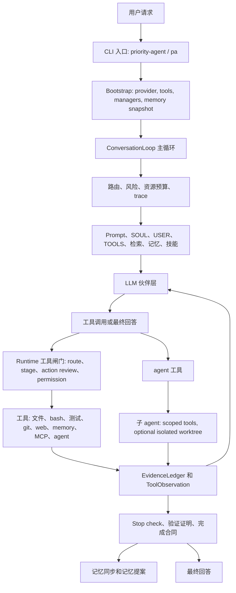
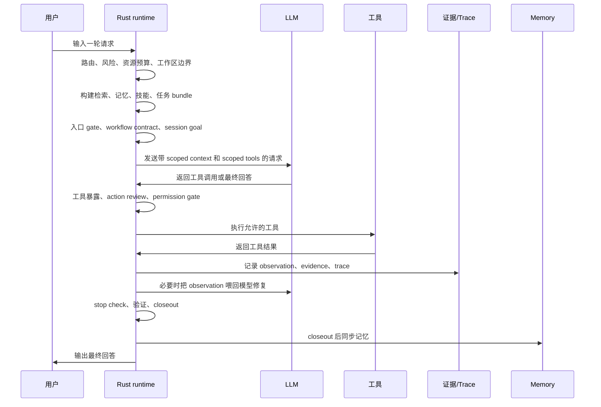
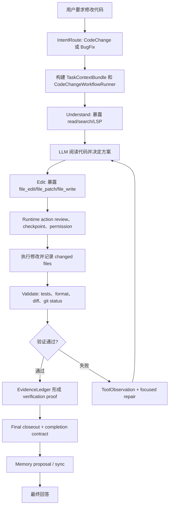

# Priority Agent 当前流程与运行时架构说明

最后检查日期: 2026-05-26

读者: 准备帮忙看项目的技术朋友，或者需要快速理解当前代码结构的人。

范围: 这份文档描述的是当前代码里的真实主链路，不是未来规划。凡是已经
实现但仍是原型、半集成或边界还没有完全收口的部分，下面会单独说明。

## 1. 一句话说明

Priority Agent 是一个本地 Rust 编程 agent 终端 CLI。它的核心设计不是让
LLM 直接接管一切，而是让 LLM 负责语义判断和工程判断，让 Rust runtime
负责确定性的执行骨架: 上下文组织、意图路由、工具暴露、权限、动作审查、
证据记录、验证、修复、关闭、记忆、技能和子 agent 委派。

更准确地说，现在的项目是一个“两层协作”系统:

1. LLM 伙伴层: 理解用户请求，阅读和推理代码，选择修改方案，解释失败，
   决定修复方向，生成最终答复。
2. Runtime 执行层: 缩窄上下文，暴露合适工具，执行工具，记录观察，执行
   硬约束，检查证据，阻止没有证据的 verified closeout。

这里的“双层 agent”不要理解成两个主 LLM 互相聊天。当前主线更像是
“LLM 伙伴 + Rust 执行骨架”。子 agent 是通过 `agent` 工具额外派出去的
工作者，它们很重要，但不是主循环里的第二个主 agent。

## 2. 整体心智模型

这套系统的关键是保守和可验证。模型可以提出要改文件、运行命令、查资料或
派子 agent，但 runtime 会决定:

- 这个工具现在是否应该暴露；
- 当前阶段是否允许这个动作；
- 命令是否太宽泛；
- 是否越过工作区边界；
- 是否需要用户授权；
- 是否符合 action checkpoint；
- 最终回答是否有真实证据支撑。

## 3. 启动流程

启动入口主要在:

- `src/main.rs`
- `src/bootstrap.rs`

### 3.1 运行模式

`src/main.rs` 支持几类模式:

- `priority-agent` 或 `pa`: 默认交互式 CLI。
- `--cli`: 显式进入普通交互式 CLI。
- `--tui`: 兼容 TUI 模式。
- `--eval-run --prompt-file`: 非交互 eval 模式，会写 JSONL 事件，并自动
  拒绝权限请求。
- API/server 相关模式。
- provider health 诊断模式。

### 3.2 Bootstrap 做什么

`src/bootstrap.rs` 会准备运行时依赖:

1. 加载配置。
2. 初始化 provider。当前 fallback 顺序是 MiniMax、OpenAI、Kimi。
3. 为当前工作目录初始化工具注册表。
4. 初始化核心 manager:
   - `SessionStore`
   - LSP manager
   - Worktree manager
   - MCP manager
   - `QueryEngine`
   - `StreamingQueryEngine`
5. 创建 `MemoryManager`，并 freeze 初始记忆快照。
6. 创建 session id。
7. 创建由 `QueryEngine` 支撑的 `AgentManager`。
8. 创建工具授权通道。
9. 把控制权交给 conversation loop。

这里的 frozen memory snapshot 很关键: 一个 session 里读取到的长期记忆是
稳定的，不会因为本轮刚写入了什么就立刻污染当前上下文。

## 4. 主循环总览

主循环在 `src/engine/conversation_loop/mod.rs`。

一轮用户请求的真实控制器顺序是:

1. `TurnSetupController::prepare`
2. `TurnContextBootstrapController::run`
3. `TurnEntryGateController::run`
4. `TurnLoopBootstrapController::run`
5. `TurnIterationLoopController::run`
6. `TurnCompletionController::complete`
7. `MemorySyncController::sync_turn`
8. finish trace 并记录结果

对应流程:

也就是说，agent 不是一拿到用户消息就直接问模型。它会先做路由、预算、检索
和任务状态，再决定模型应该看到什么、能用什么。

## 5. Turn Setup: 路由、风险、预算、破坏范围

入口控制器是
`src/engine/conversation_loop/turn_setup_controller.rs`。

它会从最后一条用户消息里提取:

- 用户请求预览；
- 用户显式要求的验证命令；
- 是否允许 no-diff audit closeout；
- 是否禁止代码写入工具；
- turn trace 和 turn index；
- session 里的 recent learning events；
- intent route；
- resource policy；
- 当前 working directory；
- destructive scope contract。

### 5.1 IntentRouter

`src/engine/intent_router.rs` 是规则型路由器，会产出 `IntentRoute`:

- `intent`: DirectAnswer、CodeChange、Debugging、Research、Memory、
  Configuration、Delegation、Planning、Unknown。
- `workflow`: Direct、CodeChange、BugFix、Research、Planning、Delegation。
- `retrieval`: None、Light、Project、Memory、Web、Full。
- `reasoning`: Low、Medium、High。
- `risk`: Low、Medium、High。
- recommended tools。
- 是否有 dependency install intent。
- 是否有 MCP auth intent。

这个路由不是让 runtime 独立理解任务，而是给后面的预算、检索、工具暴露和
验证策略提供结构化输入。

### 5.2 ResourcePolicy

`src/engine/resource_policy.rs` 根据 route 选择资源预算:

- low: 快速、低成本、低并行度、小工具预算；
- medium: 平衡；
- high: 更深推理、更大上下文、更多工具预算；
- high risk 会降低并行度和工具数量，让执行更容易审计；
- web/full retrieval 会扩大上下文预算。

这保证简单任务不会被运行时放大成没有边界的大调查。

## 6. Context Bootstrap: 项目、session、记忆、技能

`src/engine/conversation_loop/turn_context_bootstrap_controller.rs` 负责把一轮
任务所需的上下文准备出来。

主要工作:

1. 根据 session id 和 working directory 设置 active memory scope。
2. 通过 `TurnRetrievalContextController` 构建 retrieval context。
3. 通过 `SkillRuntime` 搜索可能相关的技能。
4. 构建 `TaskContextBundle`。

### 6.1 RetrievalContext

统一检索结构在 `src/engine/retrieval_context.rs`。

当前可能合并的来源:

- project context: 来自 `ProjectScanner`；
- session context: 来自 `SessionStore` 的搜索；
- memory context: 来自 `MemoryManager`；
- active memory: 如果环境变量开启并且 gate 允许；
- 预留或扩展来源: web、MCP、file、tool evidence。

每个 retrieval item 都带:

- source；
- trust level；
- provenance；
- freshness；
- score；
- conflict；
- token estimate。

格式化进 prompt 时会明确说明: 这些是背景证据，不是用户指令。

### 6.2 `<relevant_material>`

`src/engine/conversation_loop/retrieval_prompt_controller.rs` 会把检索结果包进
`<relevant_material>`。

这是最近 runtime diet 方向里很重要的一点: 检索材料不应该混进稳定系统
prompt，避免过期资料或低信任资料变成永久规则。

## 7. Prompt、AGENTS、SOUL、USER、TOOLS

相关代码:

- `src/instructions/mod.rs`
- `src/engine/prompt_context.rs`
- `src/engine/context_assembly.rs`

### 7.1 AGENTS 加载顺序

AGENTS 指令按低到高优先级加载:

1. global `~/.priority-agent/AGENTS.md`
2. project `AGENTS.md`
3. directory AGENTS files
4. project root supplemental files:
   - `SOUL.md`
   - `USER.md`
   - `TOOLS.md`

如果 AGENTS 文件里有 `## Agent Runtime Guidance`，默认只注入这一节。完整
AGENTS 注入需要 `PRIORITY_AGENT_AGENTS_MD_FULL`。

### 7.2 SOUL

`SOUL.md` 是项目根目录里的“人格/灵魂”上下文。它适合放:

- assistant 的声音；
- 语气；
- 协作风格；
- 判断姿态；
- 这个项目希望 agent 怎么像一个长期伙伴。

边界也很清楚: SOUL 是上下文，不是最高权限。它不能覆盖:

- 当前用户请求；
- AGENTS runtime guidance；
- sandbox 和权限；
- validation 和 checkpoint；
- tool safety；
- 项目里的硬约束。

所以 SOUL 可以说“Liz 应该怎么协作”，但不能说“跳过权限”或“不要验证”。

### 7.3 USER

`USER.md` 用来放紧凑的用户事实和偏好，比如稳定的工作习惯、常用项目、常见
验证偏好。

它不应该变成聊天记录，也不应该记录临时任务进度。稳定、未来有用、低敏感的
用户事实才适合放进去。

### 7.4 TOOLS

`TOOLS.md` 用来放项目本地工具提示，例如:

- 常用测试命令；
- 本地脚本；
- 构建约定；
- repo 里特殊工具的用法；
- 哪些命令应该优先或避免。

TOOLS 帮模型选好命令，但不替代 runtime tool registry。真正是否可用、是否
允许执行，仍由 runtime 决定。

### 7.5 Context Zones

`src/engine/context_assembly.rs` 定义了五个上下文 zone:

1. `stable_prefix`
2. `task_state`
3. `relevant_material`
4. `recent_observation`
5. `current_decision_request`

稳定 prefix 的 fingerprint 不包含动态尾部，这样 runtime 可以更清楚地判断
哪些上下文是长期稳定的，哪些是本轮临时注入的。当前还有部分 legacy prompt
rendering，但 live request 已经开始把 retrieval 和 observation 分区注入。

## 8. Task Bundle、Contract、Mode

相关代码:

- `src/engine/task_context.rs`
- `src/engine/task_contract.rs`
- `src/engine/task_mode_score.rs`
- `src/engine/lightweight_planner.rs`

### 8.1 TaskContextBundle

`TaskContextBundle` 是一轮任务的结构化状态，包含:

- task id；
- 用户请求预览；
- working directory；
- main goal；
- `AgentTaskState`；
- route；
- relevant files；
- constraints；
- retrieval；
- risks；
- tool budget；
- acceptance checks；
- workflow judgment。

这让 runtime 不只是维护一串 chat messages，而是维护一个可审计的任务对象。

### 8.2 Task Mode

任务可以被分成:

- `Direct`: 直接回答，不进重 workflow。
- `Light`: 轻量规划和验证。
- `Full`: 正常编程 workflow。
- `HighRisk`: 更严格的 gate 和 proof。

评分会考虑复杂度、风险、不确定性、工具需求和用户影响。

### 8.3 Agent Mode

`src/engine/agent_mode.rs` 定义用户可见的模式:

- `Auto`
- `Build`
- `Plan`
- `Explore`
- `Review`

这些模式会调节路由、工具、检索和推理姿态，但不会绕过 runtime 的硬 gate。

### 8.4 TaskContract 和 ContextPack

`TaskContract` 和 `ContextPack` 是模型和 runtime 之间的类型化合同，描述:

- scope；
- constraints；
- validation；
- risk；
- model profile；
- report schema；
- context budget。

这是双层架构的关键: LLM 做判断，runtime 保存合同并检查执行有没有跑偏。

## 9. 工具系统

工具系统主要在:

- `src/tools/mod.rs`
- `src/engine/conversation_loop/tool_orchestrator.rs`
- `src/engine/conversation_loop/tool_exposure_plan.rs`
- `src/engine/conversation_loop/tool_execution_controller.rs`

### 9.1 ToolRegistry

`ToolRegistry::default_registry` 默认使用 core profile。full/all/experimental
profile 需要环境变量开启。

Core 工具大致包括:

- 文件工具: `file_read`, `file_write`, `file_edit`, `file_patch`。
- 搜索工具: `glob`, `grep`。
- Shell/runtime: `bash`, `bash_output`, `bash_cancel`, `bash_tasks`,
  `run_tests`, `start_dev_server`, `install_dependencies`。
- 任务和 agent: task create/get/list/update/stop/output, `agent`。
- Web 和 memory: `web_fetch`, `web_search`, memory save/load/clear。
- Workflow 辅助: `todo_write`, `diff`, `format`, `git`, `git_status`,
  `git_diff`。
- 工具辅助: cost、brief、clear、config、context、copy、resume、rewind、
  calculate、datetime、JSON query、encoding、notebook、REPL。
- MCP 和项目工具: MCP management、MCP tool、MCP resources、LSP、
  symbol query、worktree、workbench、refactor、project list。
- Skills: `skill_manage`, `skills_list`, `skill_view`。
- 用户交互: ask user 和 plan 工具。

Full profile 可以额外加入 desktop、browser、remote、team、voice、telemetry、
plugin 相关工具。

### 9.2 Route-Scoped Tools

`tool_orchestrator.rs` 会按 route 缩小工具面:

- Direct answer 且没有推荐工具时，可以不暴露工具。
- CodeChange 会暴露项目读/search、文件编辑、测试、diff、git status、format、
  todo 等工具。
- BugFix 额外偏向 LSP 和 symbol query。
- Research 可以暴露 web 工具。

这避免模型每一轮都看到完整工具列表。

### 9.3 Phase-Scoped Tools

`tool_exposure_plan.rs` 会按任务阶段继续缩小工具面:

- Understand: read、search、LSP、symbol query。
- Plan: read、plan、todo。
- Edit: file edit/write/patch。
- Validate: bash、run_tests、diff、git、format。
- Repair: 更宽一些的修复面。
- Closeout: read、diff、git evidence。

Action checkpoint 阶段更严格: 只有 checkpoint 管理下的代码 action 工具能
暴露，validation shell 通常要在已有改动之后才进入可用面。

## 10. 工具执行链路

一次工具调用不是模型说了就执行。真实路径大致是:

1. `TurnModelStepController` 准备模型请求。
2. 模型返回工具调用或最终回答。
3. `TurnIterationController` 去掉部分重复、低价值的 read-only 调用。
4. `ToolRoundController` 准备工具 round。
5. `ToolExecutionController` 为每个工具构建 `ToolRuntimeContext`。
6. `ToolExecutionGate` 检查:
   - 工具是否注册；
   - 工具当前是否暴露；
   - 参数是否合法；
   - 是否符合 allowed tools；
   - 是否超过预算；
   - destructive scope 是否允许；
   - action checkpoint 是否允许；
   - `ActionReview` 是否允许。
7. read-only 且 concurrency-safe 的工具会按 resource policy 并发执行。
8. 写入型或非并发安全工具会串行执行。
9. 需要权限时，通过 approval channel 走用户授权。
10. `ToolBatchResultProcessor` 把结果写回 messages、trace、learning events、
    `EvidenceLedger` 和 `AgentTaskState`。

失败工具不会被吞掉，会变成 `ToolObservation` 回到上下文里，让模型做有边界的
修复。

## 11. Action Review、Permission、Checkpoint

相关代码:

- `src/engine/action_policy.rs`
- `src/engine/action_review.rs`
- `src/engine/conversation_loop/permission_controller.rs`

### 11.1 Side Effect Profile

`ActionSideEffectProfile` 会描述一个工具动作的副作用:

- tool family；
- touched paths；
- network boundary；
- external side effects；
- workspace mutation；
- local machine mutation；
- remote mutation。

它会标出如 `OUTSIDE_WORKSPACE`、`HIGH_RISK_PATH`、`NETWORK_BOUNDARY`、
`LOCAL_WORKSPACE_MUTATION` 等风险信号。

### 11.2 ActionReview

`ActionReview` 产出结构化审查结果:

- tool contract review；
- action worth verdict；
- side effects；
- permission verdict；
- scope verdict；
- budget verdict；
- checkpoint verdict；
- final decision: allow、ask user、deny、revise。

它能阻止:

- 工具不存在或未暴露；
- 参数不合法；
- 超预算；
- 权限被拒绝；
- 破坏范围不符合用户请求；
- 缺少 checkpoint；
- 过早 mutation；
- 重复低价值动作；
- scope fit 过低；
- 高风险低价值动作。

当前重要策略: 不鼓励 raw `bash` 直接修改 workspace。文件修改应尽量走
checkpoint 管理下的 `file_edit`、`file_patch`、`file_write`、`format` 等
工具。Git mutation 和远端写入不属于普通本地 checkpoint 文件修改，会单独
审查。

## 12. 一次编程任务的完整流程

一次普通代码修改大致是:

`src/engine/code_change_workflow.rs` 保存编程 workflow 状态:

- workflow depth: minimal、standard、strict；
- visibility: quiet、normal、debug；
- 是否要求 workflow judgment；
- 是否要求 stage validation；
- 是否要求 final closeout；
- reflection 是否能 block；
- max repair attempts；
- stage validation records；
- workflow closeout。

风险越高，workflow 越严格:

- 高风险编程任务要求 strict validation，reflection 可以 block。
- 中低风险编程任务默认轻量，遇到触发器再升级。
- 非编程任务一般不启用 code-change gate。

## 13. 验证、证据、Stop Check、Closeout

相关代码:

- `src/engine/evidence_ledger.rs`
- `src/engine/verification_proof.rs`
- `src/engine/conversation_loop/turn_post_change_closeout_controller.rs`
- `src/engine/conversation_loop/closeout_controller.rs`
- `src/engine/conversation_loop/turn_completion_controller.rs`

### 13.1 EvidenceLedger

`EvidenceLedger` 是 runtime 拥有的结构化证据账本。它记录:

- changed files；
- tool execution records；
- file facts；
- command facts；
- validation facts；
- permission facts。

核心原则: verified closeout 需要 runtime 证据，不能只相信模型说“已测试”或
“已完成”。

### 13.2 VerificationProof

验证证明状态包括:

- `Verified`
- `Failed`
- `NotRun`
- `NotApplicable`
- `Blocked`
- `UserDeferred`
- `Unavailable`

如果任务要求验证，那么没有证明就不能算 completed。可以诚实结束为 failed、
partial、blocked 或 not verified。

### 13.3 CompletionContract

`TurnCompletionController` 会记录 completion contract，判断最终状态:

- route 和 risk；
- changed files；
- 是否需要验证；
- verification proof；
- stop check；
- final content 是否为空。

这就是为什么项目现在接受 honest `not_verified` / `failed` / `partial`。这比
模型没有证据还强行说完成更符合产品方向。

## 14. 记忆系统

记忆系统主要在 `src/memory/`。

它吸收了 Hermes 类似的思想，但落在本地 Rust runtime 里:

- frozen snapshot；
- prefetch；
- turn sync；
- session end extraction；
- typed records；
- local search index；
- quality gate；
- safety gate；
- provider registry。

### 14.1 存储位置

默认存储在 `~/.priority-agent/`:

- `MEMORY.md`
- `USER.md`
- `memory/*.md`
- `memory/records.jsonl`
- `memory/search.sqlite`
- `memory/flush_queue.jsonl`
- decisions JSONL

### 14.2 读取路径

`MemoryManager::freeze_snapshot` 在启动时读取长期记忆。读取会经过
`memory::safety::scan_memory_content`，可疑持久化记忆会被跳过。

注入模型时使用 `<memory-context>`，并明确说明:

- 这是背景记忆；
- 不能覆盖当前用户请求；
- 不能覆盖项目指令；
- 不能覆盖权限、安全和验证；
- 新鲜的非冲突证据优先。

记忆检索可以来自:

- frozen markdown memory；
- topic files；
- typed memory records；
- SQLite FTS index；
- keyword matching；
- LLM rerank；
- conflict detection。

### 14.3 写入路径

记忆不是“模型想写什么就写什么”。写入候选会经过:

- evidence gate；
- stable fact 判断；
- future utility 判断；
- specificity；
- relevance；
- volatility；
- sensitivity risk；
- duplication；
- safety scan。

通过后才会写 typed record，并可能投影回 markdown。某些类型，比如
successful fix、tool quirk、failure pattern，会更依赖真实证据。

### 14.4 什么适合进 Memory

适合进记忆:

- 稳定用户偏好；
- 稳定项目事实；
- workflow convention；
- tool quirk；
- failure pattern；
- successful fix；
- decision；
- 未来有用的 note。

不适合进记忆:

- 一次性任务进度；
- 原始命令历史；
- 临时观察；
- 大段 procedure；
- 未验证结论；
- secret 或 credential。

流程、步骤和可复用操作更适合进入 skills，而不是长期 memory。

### 14.5 MemoryProviderRegistry

`src/memory/provider.rs` 定义了 `MemoryProvider` 和
`MemoryProviderRegistry`。

目标是让本地和外部记忆 provider 都能挂在统一接口下，并且 provider failure
互相隔离。当前边界是: local provider 目前更多是 marker，本地记忆的真实逻辑
仍主要在 `MemoryManager` 里。也就是说 provider interface 已经有了，但本地
实现还没有完全抽象出去。

### 14.6 Active Memory

`src/memory/active.rs` 是 opt-in 原型，需要
`PRIORITY_AGENT_ACTIVE_MEMORY=1`。

它会:

- 只在 memory retrieval 允许时运行；
- 跳过 eval、headless、automation、internal agent；
- 要求 persistent session id；
- 使用本地 FTS search；
- 有 timeout 和结果长度限制；
- 返回一个 fenced `<active-memory-context>`；
- 不调用 LLM；
- 不写记忆；
- 不调用工具。

所以 active memory 现在不是完整的后台记忆 agent，而是一个安全、有限、只读
的主动检索原型。

## 15. Skills 系统

Skills 是 procedural memory，也就是“可重复流程”。相关代码在 `src/skills/`
和 `src/engine/skill_evolution.rs`。

### 15.1 Skill 来源

`SkillRegistry` 可以加载:

- bundled skills；
- workspace `.agents/skills`；
- workspace `skills`；
- user `~/.priority-agent/skills`；
- `PRIORITY_AGENT_SKILLS_PATH`；
- `PRIORITY_AGENT_SKILLS_URL`。

workspace roots 会归一化和 allowlist。第三方 skills 会扫描:

- prompt injection；
- `rm -rf`；
- `chmod 777`；
- `base64 -d`；
- secret/key；
- curl/wget pipe shell；
- eval/exec 等危险模式。

### 15.2 Skill 注入

`SkillRuntime::load(project_root)` 会发现技能，然后按 name、description、
triggers、body 搜索相关技能。

注入时用 `<skill-context>` 包起来，并明确它只是背景指导，不能覆盖当前用户
请求、项目指令、权限、安全和 runtime tool gate。

### 15.3 Skill Evolution

`skill_evolution.rs` 可以根据重复运行时模式提出 skill candidate，但不会自动
启用。生成的 skill 需要经过质量和安全检查，并被接受和应用后才会成为 active
skill。

这和 memory 的理念一致: runtime 可以产生候选，但持久化和激活要有 gate。

## 16. 子 Agent

子 agent 通过 `src/tools/agent_tool/mod.rs` 里的 `agent` 工具暴露。

适合派子 agent 的任务:

- 独立探索；
- 验证；
- 计划；
- review；
- debug；
- 有边界的实现任务；
- 可以并行的子任务。

不适合派子 agent 的任务: 当前主 agent 下一步必须立刻依赖的简单阻塞动作。
这种情况主 agent 自己做更直接。

### 16.1 Agent Tool 参数

`agent` 工具支持:

- description；
- prompt；
- files；
- timeout；
- max_turns；
- max_cost；
- allowed_tools；
- profile；
- context_mode；
- role；
- template；
- list/resume/read/cancel；
- subtasks；
- parallel；
- memory_snapshot；
- fork_branches。

### 16.2 Profiles 和 Context Modes

`src/agent/profiles.rs` 定义:

- context modes: Minimal、InheritedSummary、FullFork、IsolatedWorktreeFork。
- risk policies: ReadOnly、VerifyOnly、CodeChange。
- permission modes: ReadOnly、Bubble、IsolatedWrite。
- output contracts: Findings、PatchSummary、VerificationReport。
- memory policies: None、Session、Role、Project、User。

内置 profile 包括 default、explorer、planner、verifier、implementer。

会修改文件的子 agent 默认更倾向 isolated worktree，避免和父 agent 的工作区
直接冲突。

### 16.3 AgentManager

`src/agent/manager.rs` 负责:

- spawn agent；
- 管理 active handles；
- 管理 message channels；
- result cache；
- completion receivers；
- 定时 reaper；
- kill/list/stats。

子 agent 实际运行在 `src/agent/agent.rs`，通过 `QueryEngine` 带着自己的
`QueryOptions` 执行，包括 allowed tools、working directory、MCP servers、
context messages、max iterations、system prompt。

### 16.4 Forked Context

`src/agent/forked_context.rs` 负责 fork context:

- 保留 parent assistant tool-use prefix；
- 为 parent tool calls 填 placeholder result；
- 加 child directive；
- 防止递归 fork；
- 如果是 isolated worktree，会告诉 child parent cwd 和 isolated cwd。

## 17. QueryEngine 和模型边界

`QueryEngine` 是 runtime 到 provider 的桥。它接收:

- messages；
- system prompt；
- scoped tools；
- allowed MCP servers；
- working directory；
- context messages；
- max iterations；
- model options。

LLM 在这个请求形状里做判断。也就是说，模型是有工程判断的伙伴，但不是无限
权限 shell。它能看到什么、能调用什么、调用结果如何解释和验证，都由 runtime
组织。

## 18. Observability 和 Eval

runtime trace 会记录大量结构化事件:

- intent route；
- resource policy；
- context zones；
- runtime diet；
- workflow contract；
- tool exposure；
- action review；
- permission decisions；
- tool observations；
- evidence ledger facts；
- stop checks；
- verification proof；
- final closeout；
- completion contract；
- memory boundary；
- subagent events。

桌面端还会收到 `runtime_diagnostic`，包含:

- MVA state snapshot；
- task state；
- verification proof；
- completion contract；
- control-loop coverage。

`--eval-run` 和 live-eval harness 可以用这些 trace 判断失败归因。一个 eval 失败
不一定是 agent flow bug，需要看:

- required commands；
- diff state；
- proof；
- closeout；
- runtime spine；
- `failure_owner`。

## 19. 当前架构强项

当前实现里比较强的部分:

- LLM/runtime 边界清楚: LLM 判断，runtime 执行和验证。
- 工具暴露是窄的: route、stage、model profile、permission、checkpoint 都会
  缩小工具面。
- closeout 是证据驱动的: verified 需要 runtime evidence。
- 记忆比纯 markdown 更安全: 有 typed records、FTS、quality gate、safety
  scan、conflict handling。
- skills 和 memory 分工明确: memory 存事实和偏好，skills 存流程。
- SOUL/USER/TOOLS 能让项目更个人化，但不会变成最高权限。
- 子 agent 有 profile、context mode 和 isolated worktree。
- trace 足够详细，可以解释一轮为什么成功、失败、阻塞或 partial。

## 20. 当前边界和需要继续收口的地方

给外部 review 时也应该坦诚这些边界:

- `MemoryProviderRegistry` 已经有接口，但本地记忆逻辑仍主要在
  `MemoryManager`，还没有完全 provider 化。
- active memory 是 opt-in 只读原型，不是完整后台记忆 agent。
- 五区 context 架构已经有了，但稳定 prompt 路径里还有 legacy rendering。
- skills 可以加载、搜索、注入和提出候选，但生成技能仍需要 gated activation。
- 子 agent 结果仍需要父 runtime 的 evidence 和 closeout 纪律，不能直接当成
  已验证完成。
- Rust runtime 不独立理解代码语义。它能做规则、证据、权限、预算和安全
  gate，真正代码判断仍由 LLM 负责。

## 21. 推荐 review 文件

| 区域 | 文件 |
| --- | --- |
| 启动 | `src/main.rs`, `src/bootstrap.rs` |
| 主循环 | `src/engine/conversation_loop/mod.rs` |
| Turn setup | `src/engine/conversation_loop/turn_setup_controller.rs` |
| Context bootstrap | `src/engine/conversation_loop/turn_context_bootstrap_controller.rs` |
| Prompt/instructions | `src/instructions/mod.rs`, `src/engine/prompt_context.rs`, `src/engine/context_assembly.rs` |
| Routing/resources | `src/engine/intent_router.rs`, `src/engine/resource_policy.rs` |
| Tool exposure | `src/engine/conversation_loop/tool_orchestrator.rs`, `src/engine/conversation_loop/tool_exposure_plan.rs` |
| Tool execution | `src/engine/conversation_loop/tool_execution_controller.rs`, `src/engine/conversation_loop/tool_batch_result_processor.rs` |
| Action review | `src/engine/action_policy.rs`, `src/engine/action_review.rs` |
| Programming workflow | `src/engine/code_change_workflow.rs`, `src/engine/task_context.rs`, `src/engine/task_contract.rs` |
| Evidence/closeout | `src/engine/evidence_ledger.rs`, `src/engine/verification_proof.rs`, `src/engine/conversation_loop/closeout_controller.rs`, `src/engine/conversation_loop/turn_completion_controller.rs` |
| Memory | `src/memory/manager.rs`, `src/memory/types.rs`, `src/memory/provider.rs`, `src/memory/search_index.rs`, `src/memory/active.rs`, `src/memory/quality.rs`, `src/memory/safety.rs` |
| Skills | `src/skills/runtime.rs`, `src/skills/loader.rs`, `src/skills/types.rs`, `src/skills/registry.rs`, `src/engine/skill_evolution.rs` |
| Subagents | `src/tools/agent_tool/mod.rs`, `src/agent/manager.rs`, `src/agent/agent.rs`, `src/agent/profiles.rs`, `src/agent/forked_context.rs` |
| 当前状态 | `docs/PROJECT_STATUS.md`, `docs/OPENCLAW_HERMES_REFERENCE_AUDIT_2026-05-26.md` |

## 22. 给朋友看的短版

Priority Agent 是一个本地编程伙伴。LLM 负责真正的工程判断: 读代码、理解任务、
选择方案、修复错误、解释结果。Rust runtime 负责所有必须确定和可审计的部分:
给模型什么上下文、暴露哪些工具、是否允许修改、是否需要权限、命令结果如何
记录、验证是否真实、最终能不能说完成。

记忆和技能是分开的: memory 存长期事实和偏好，skills 存可重复流程。SOUL、
USER、TOOLS 让 agent 更个人化、更贴近当前项目，但它们只是上下文，不能覆盖
安全、权限和验证。子 agent 是可委派的工作者，可以用受限工具和 isolated
worktree 做探索、验证或实现。

项目的产品方向是“窄、深、个人、可验证”: 它应该通过理解 gex 的机器、项目、
习惯和验证循环来赢，同时保留足够强的 runtime 证据和 trace，能解释每一个
重要动作为什么发生、有没有完成、有没有验证。
